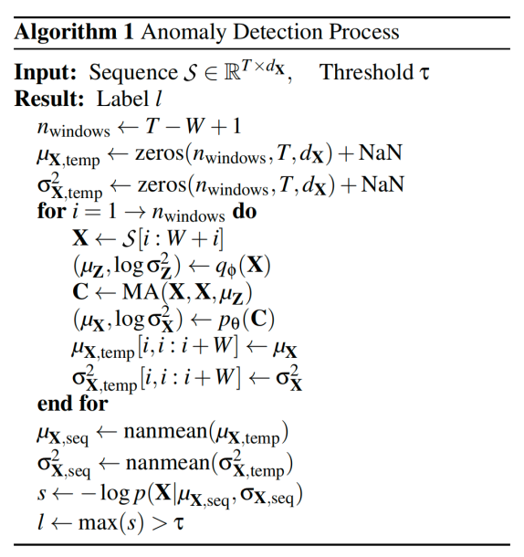

# MA-VAE架构

利用transformer架构的模型进行异常检测，可以视作给定输入序列X，输出结果Y，通过结果Y判断当前生产过程是否出现异常的过程。

MA-VAE（Multi-head Attention-based Variational Autoencoder）的*多头注意力（MA）* 和 *VAE（实际上就是BiLSTM（abidirectional long short-term memory）* 实际上就是应用在上述过程的不同环节中。
## MA-VAE模型架构解释

1. **BiLSTM编码器**：BiLSTM 处理输入 X 得到潜在分布 $(\mu_Z, \log \sigma^2_Z) = \text{BiLSTM}_{\text{encoder}}(X)$

>和标准 LSTM-VAE 一致，关键（/优势）在于输入是一个按照时间窗口采样的序列，BiLSTM 可以捕捉时间结构，也就是获取X的时序信息。

2. **采样潜变量 $Z$**

$Z = \mu_Z + \epsilon \cdot \sigma_Z \quad \text (训练时提高精度）$或$ \quad Z = \mu_Z（推断时保证推断速度/监测效率（？））$

>如果模型很好地“理解”了输入 X 的分布规律，它就应该能从潜在变量 Z 中重构出一个与 X 非常接近的序列。

3. **多头注意力机制结合方式（他们的创新点）**：
	1. Input X generates Query and Key through linear transformations:
	   $Q_i = X W^Q_i,\quad K_i = X W^K_i$

	2. Latent variable Z generates Value through transformation:
	   $V_i = Z W^V_i$

	3. Multi-head attention output:
	   $C_i = \text{Softmax}\left(\frac{Q_i K_i^\top}{\sqrt{d_K}}\right) V_i$

	4. Concatenate all heads:
	   $C = \text{Concat}(C_1, \dots, C_h) W^O$

   >区别于标准 Transformer：$Q,K $来自$ X$，但$V$ 来自 $Z$ ，强制 attention 依赖于潜变量 Z。这是他们的一个创新点，为了避免一个叫作 $Bypass Phenomenon$ 的问题
- 总之，这一步得到的 $C$ 是一个理解了输入X和潜在变量Z（融合了X的时序信息）的变量。

4. BiLSTMDecoder解码器：接收 $C$ 生成**重构分布**

$(\mu_X, \log \sigma^2_X) = \text{BiLSTM}_{\text{decoder}}(C)$

模型试图从潜在变量 $Z$ 中恢复出原始输入 $X$，即通过解码器预测出一个分布 $p_\theta(X | Z)$，该分布的均值 $\mu_X$ 应该尽量接近真实输入。

总结：

1. 变分自编码器(Variational AutoEncoder)生成带有时序信息的潜变量$Z$，然后自注意力模块(MA)使用$X$和$Z$生成上下文向量$C$
2. 解码器使用 $C$ 输出：$(\mu_X, \log \sigma^2_X) = p_\theta(C)$
3. **目标是让 $\log p(X|\mu_{X,seq},\sigma_{X,seq})$ 也就是重构误差最小。**

## 模型如何在实时监测中使用
*Problem Difinition:
Suppose X is a collection of M related univariate time
series. Let $X = (x_1, x_2, ..., x_T ) ∈ R^{M×T}$ , where *T*
is the length of *X* and $x_t = (x_1, x_2, ..., x_T) ∈ R^
{M} $ is
an M-dimensional（每一个样本点的维度，描述变量） vector at time $t ∈ [1, T]$.
Given a time *t*, whether $x_t$ is recognized as an anomalous
value depends on the past input series.*

当重构误差大于某设定阈值时，则报告异常。
